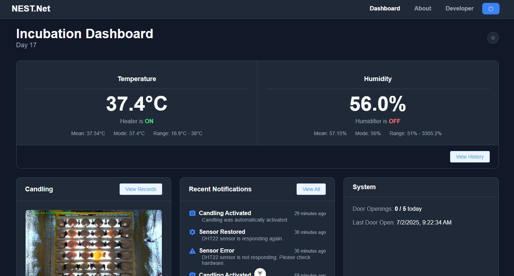

# Brian Balili - Personal Portfolio Website



This repository contains the source code for my personal portfolio website. It is a fully responsive, single-page site designed to showcase my skills, projects, and professional experience as an aspiring software developer.

**Live Demo:** [**your-website-link.com**](https://your-website-link.com) ☚ *(Replace this with your actual live URL)*

---

## ➤ Features

- **Single-Page Layout:** A smooth, modern, single-page experience with seamless scrolling between sections.
- **Dynamic Content:** Interactive elements and animations powered by jQuery and CSS to engage visitors.
- **Fully Responsive:** The layout is optimized to work flawlessly on desktops, tablets, and mobile devices.
- **Side Dot Navigation:** An intuitive side navigation menu that tracks scroll position and allows for quick jumps between sections.
- **Structured Sections:** Clear and organized sections for:
  - **About Me:** A personal introduction and summary.
  - **Skills:** A card-based overview of technical proficiencies.
  - **Projects:** A showcase of my most significant work with links to live demos and repositories.
  - **Experience:** A detailed look at my professional internship.
  - **Education:** A clean, timeline-style presentation of my academic background.
  - **Contact:** A professional footer with contact information and social links.

---

## 🛠️ Tech Stack

This project was built using fundamental web technologies and popular libraries:

- **HTML5:** For the core structure and content.
- **CSS3:** For all styling, including animations, transitions, and responsive design.
- **JavaScript (ES6):** For interactive elements and DOM manipulation.
- **jQuery:** Used for simplifying DOM traversal and event handling.
- **Bootstrap:** Utilized for its responsive grid system.
- **IcoMoon:** For custom icon fonts.
- **Waypoints.js:** For triggering animations and navigation changes on scroll.

---

## 📂 Repository Structure

The repository is organized with a clear and logical folder structure:


Brian Portfolio/
├── css/              # All stylesheets
├── fonts/            # Web fonts (Bootstrap & IcoMoon)
├── images/           # All images used on the site
├── js/               # All JavaScript files
└── index.html        # The main entry point of the website
└── resume.pdf        # My professional resume
└── README.md         # You are here!


---

## 🚀 How to Run Locally

No complex setup is required to run this project. Simply follow these steps:

1.  **Clone the repository:**
    ```bash
    git clone [https://github.com/your-username/your-repo-name.git](https://github.com/your-username/your-repo-name.git)
    ```
2.  **Navigate to the project directory:**
    ```bash
    cd your-repo-name
    ```
3.  **Open `index.html`:**
    Open the `index.html` file in your favorite web browser (e.g., Chrome, Firefox, Safari).

---

## 🔧 Customization

All the content on the website can be easily customized by editing the `index.html` file directly. Each section is clearly commented and organized:

-   To update personal information, edit the content within the `<div id="colorlib-about">`.
-   To change skills, modify the `.skill-card` elements in `<div id="colorlib-services">`.
-   To add or change projects, edit the `.work-entry-flex` blocks in `<div id="colorlib-work">`.
-   To update your resume, replace the `resume.pdf` file in the root directory.

---

## 🙏 Credits

This portfolio was built upon a template provided by **[Colorlib](https://colorlib.com)**. I have heavily customized and refactored the original code, redesigned the layout, and added new sections and functionality to fit my personal brand.

---

## 📬 Contact

-   **Email:** [brian.balili3@gmail.com](mailto:brian.balili3@gmail.com)
-   **LinkedIn:** [linkedin.com/in/brianbalili0603](https://linkedin.com/in/brianbalili0603)
-   **GitHub:** [@eautify](https://github.com/eautify)
